# An Augmented Thermal Camera

The edge-server is the application to track the robots and display the annotated video and events.

## 1. Why Thermal Cameras?
Thermal cameras can see what vivible light cameras can't. They can also measure the temperature of the target without contact.
Here is a limited list of thermal camera use cases. You can find many more by just goggling the subject.
* Electrical equipment maintenance
* First responders (firefighters)
* Security (detecting intruders)
* Animal Health (fever)
* Preventive Maintenance (friction in * machinery generates heat)
* Gas Detection (temperature difference at the point of a leak)
* Heat Loss (in buildings)

## 2. Why are Thermal Cameras so expensive?
Thermal Cameras are expensive because:

* Not mass produced like visible light cameras ie, no ecomomy of scale
* IR detectors require use of exotic material like Gallium Arsenide (GaAs) which add to the cost
* Thermal camera lenses cannot use glass, they require use of rare elements like Germanium which further add to the cost
* Cooled thermal sensors are even more expensive

## 3. Comparing Two Products on the Market
### 3.1 FLIR E5-XT
Thermal cameras are expensive eg, the FLIR E5-XT having a 160×120  resolution costs US$1,499
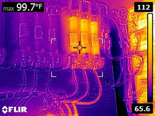

### 3.2 M5stick T-Lite Thermal Camera

###
Cheaper ones eg, those based on the Melexis MLX90640, only have a 32x24 resolution eg, the M5stick T-Lite Thermal Camera costs US$79. You can’t see too much detail in the thermal image. 

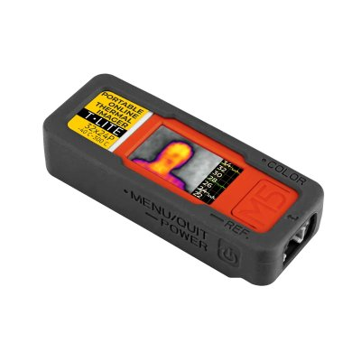

As they say: you get what you pay for. You can see the resolution which affects the quality of the images.

## 4. Before and After Augmentation
I am going to show you 3 sets of images. The first image in each set is the thermal images you get from the inexpensive M5stick T-Lite Thermal Camera. Without looking at the next 2 images augmented with more details. I bet that you won't be able to tell what was in the thermal image!

### 4.1. Me Waving my Hand
Thermal Image
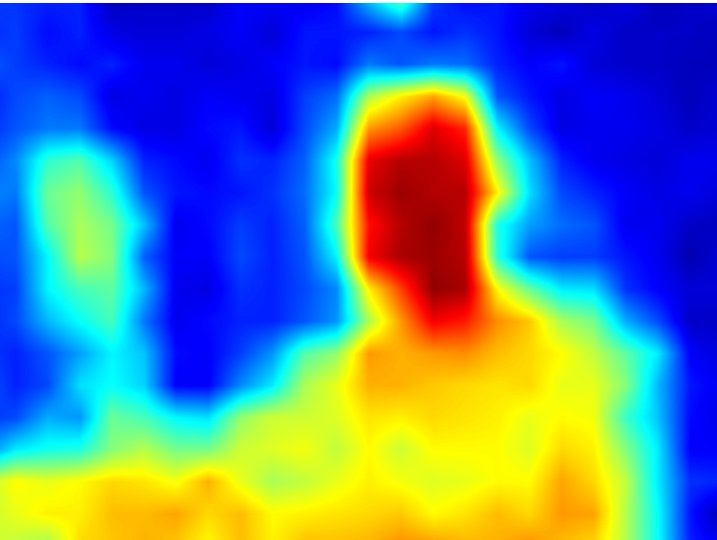

Augmented Thermal Image #1
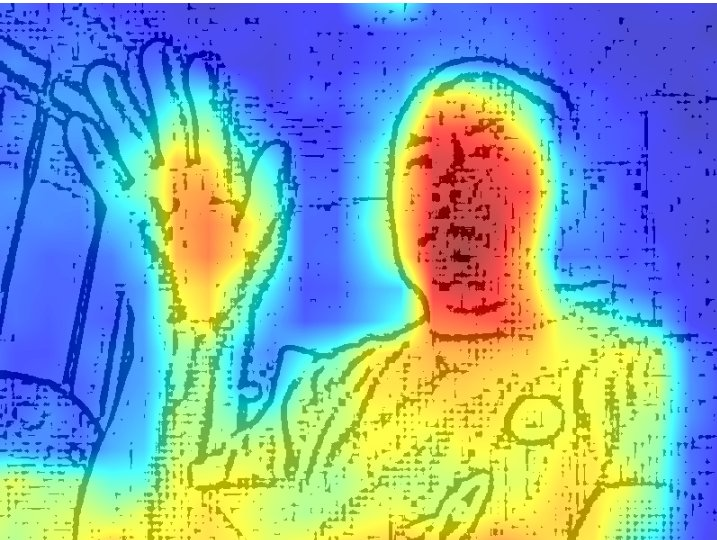

Augmented Thermal Image #2
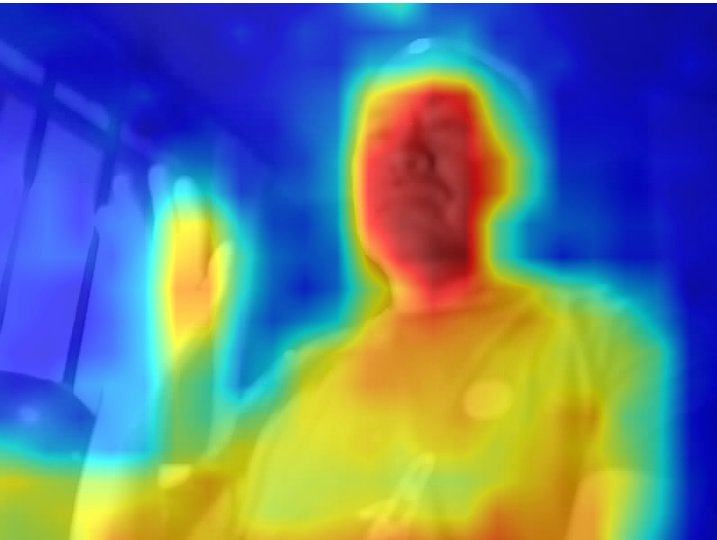

### 4.2. My Notebook's Keyboard
Thermal Image
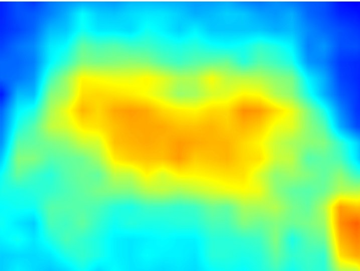

Augmented Thermal Image #1
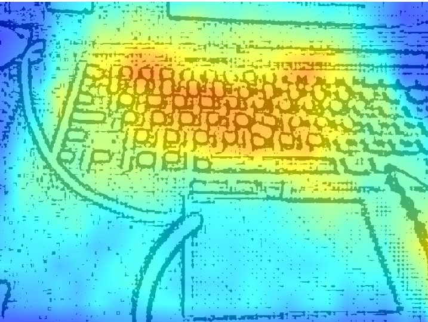

Augmented Thermal Image #2
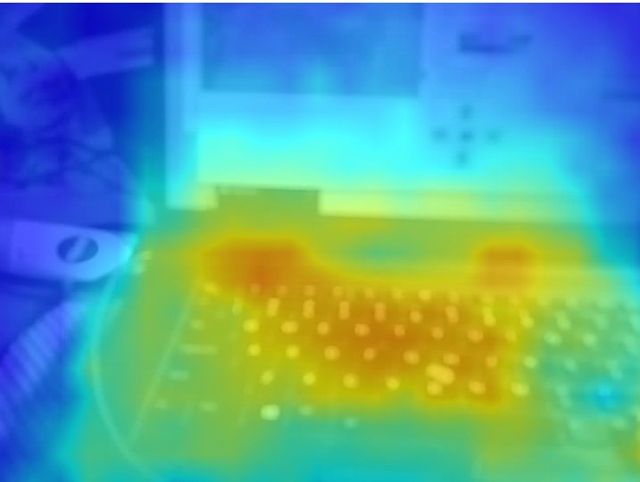

### 4.3. A Solering Iron
Thermal Image
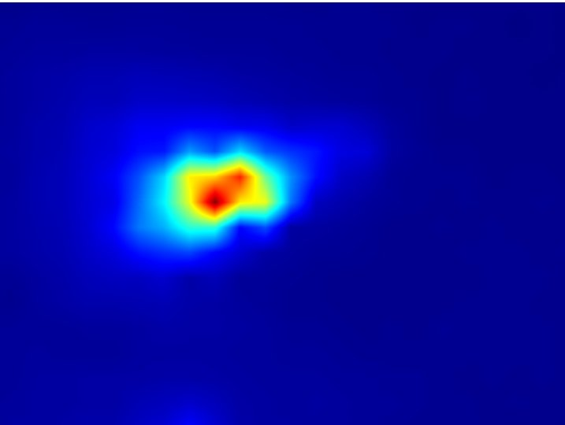

Augmented Thermal Image #1
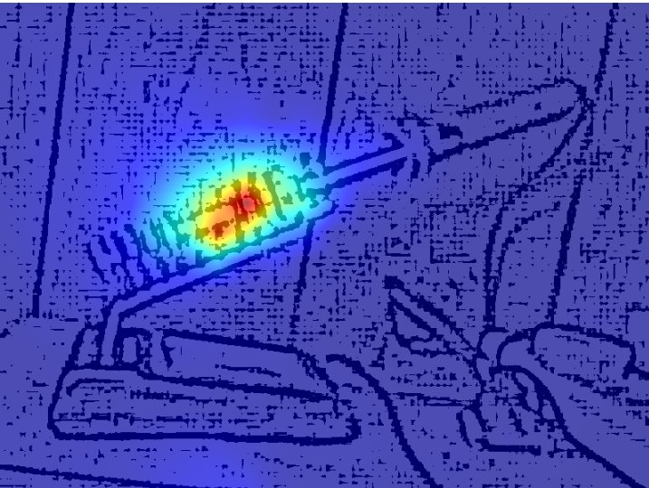

Augmented Thermal Image #2
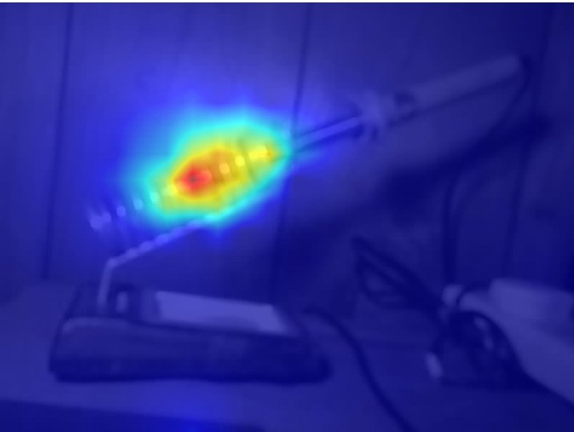

## 5. How Did I do It?
That augmented images were pretty amazing, right? If you want to know how I did it, just change to the 'thermalCamera' folder where all is revealed.