# Augmentation - Adding Details to Low Resolution Thermal Camera Images

Here is my YouTube video:

## 1. The Trick: Adding a Normal Visible Light Camera
To achieve the results shown peviously, I have to add a normal visible light camera to provide the image details. These are the cameras I used in my demo.

M5stick T-Lite Thermal Camera Dev Kit (MLX90640) provides the thermal image (US$79)

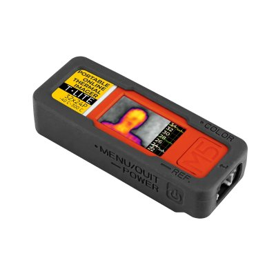

M5CAMERA PSRAM Camera Module with ESP32 WROVER (OV2640) provides details to the thermal image (US$14.95)

<em>Note that the M5Camera is old and may be End-Of-life by now. If you can't find it, use one of the following instead:</em>

[ESP32 PSRAM Timer Camera Fisheye (OV3660)](https://shop.m5stack.com/products/esp32-psram-timer-camera-fisheye-ov3660)
for US$19.95
or

[ESP32 PSRAM Timer Camera X (OV3660)](https://shop.m5stack.com/products/esp32-psram-timer-camera-x-ov3660)
for US$17.95

<em>The RTSP server firmware was actually designed and written to run on the 2 cameras listed above. I used the M5Camera only because I can harness one from an old project.</em>

## 2. How it Works

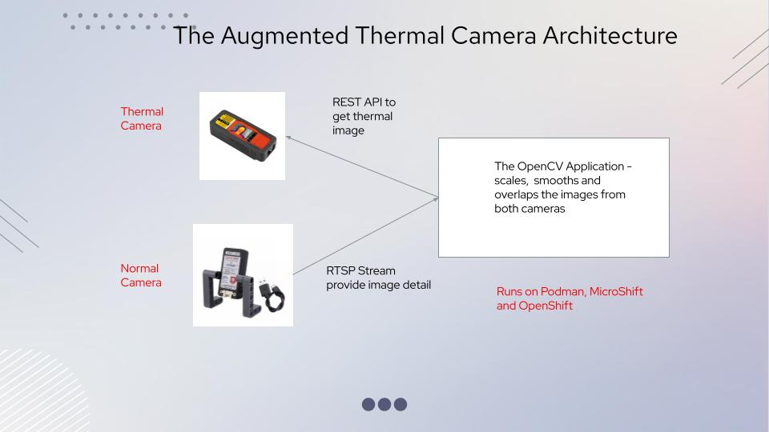

The setup consists of 3 components:
### 2.1 The M5stack T-Lite Thermal Camera
This camera packs a lot of functionality in a small package. It has Wifi and a 135 X 240 screen to dislay thermal images. Users can set the high temperature warning function, and view temperature images and data in real time through the cloud and LAN. It also provides a REST API to get temperature images in json format. It is the REST API that the 'Augmented Thermal Camera (ATC) Web Application' uses to retrieve the temperature image using HTTP GET.

### 2.2 The Normal Visible Light M5CAMERA
I reprogrammed this camera to function as a RTSP server. By the way, RTSP stands for Real-Time Streaming Protocol. It streams realtime video to an endpoint. The ATC web Application captures the video stream from this endpoint.

### 2.3 The Augemented Thermal Camera (ATC) Web Application
This appplication was written in Python using OpenCV to augment the thermal images with the RTSP images.

The application consists of 3 threads:
* one thread receives the RTSP stream and put the images in a LIFO queue (stack). Only the latest one will be used
* another thread gets temperature images using HTTP GET from the T-Lite thermal camera, scales and smooths the images to match the RTSP image's resolution and put the images in a LIFO queue (stack). Only the latest one will be used
* the main thread gets the latest images from the thermal camera and RTSP queues and overlaps the images to provide details to the thermal image.This is a web application meaning that you access the user interface using a web browser.

This web application has been containerised and can be run/deployed using Podman, MicroShift, OpenShift and other Kubernetes variants. 

## 3. An Augmented Thermal Camera Prototype
Most people use smoke and mirrors but I use a small shipping box and some rubber bands instead to quickly hack together a prototype. How I wished I had a 3-D printer though!
  
The cameras have to be placed as closely together as possible. To do that, I have to cut off the M5CAMERA's ring-shaped LEGO-adapter on each side used to fit the leg-stand. The M5CAMERA does not have an in-built battery like the T-Lite Thermal Camera. A Grove cable is used to power the M5CAMERA from the T-Lite.

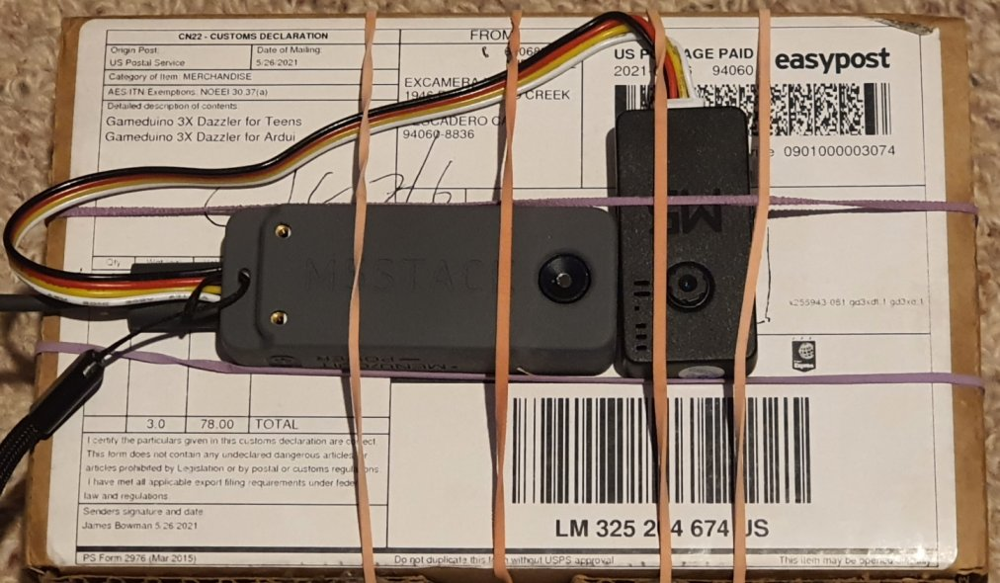

## 4. The Augmented Thermal Camera Web Application User Interace
You would have seen the UI in my video.
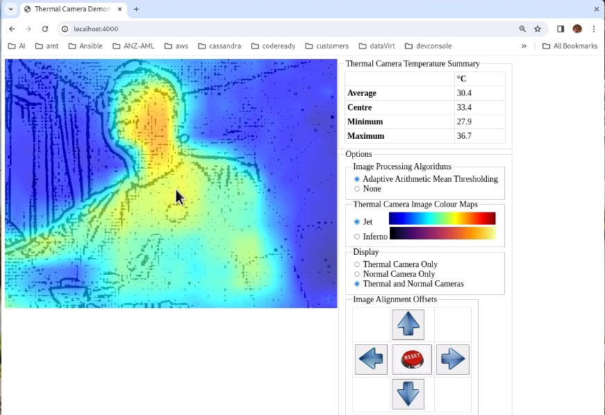

### 4.1 The Image Panel
On the left is the image panel which displays either the thermal, normal or overlapped image of the two. What you see is controlled by the panel on the right.

### 4.2 The Thermal Camera Temperature Summary Panel
On the top of the right panel, you'll see a temperature summary display showing the average, centre, minimum and maximum temperatures of the thermal image.

### 4.3 The Options Panel
Just below it, you'll see the Options panel which consists of the following:

#### 4.3.1 The Image Processing Algorithms Panel
 The first option is Image Processing Algorithms: 'Adaptive Arithmetic Mean Thresholding' and None. These options apply to the normal camera images only. Initially I implemented several different algorithms but cut them back to 1 because the 'Adaptive Arithmetic Mean Thresholding' looks heads and shoulders above the others. Let me show what the image using each option looks like. 
 
 Using Adaptive Arithmetic Mean Thresholding Algorithm:
 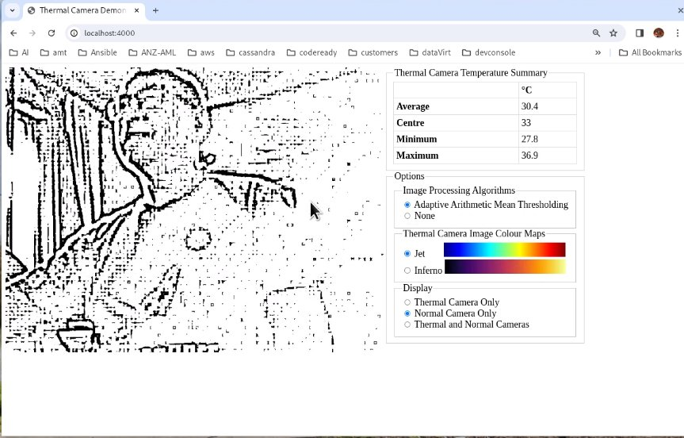

 Not Using any Image Processing Algorithm (None):
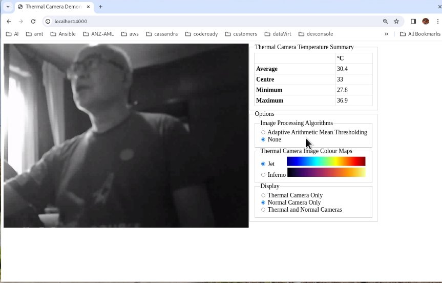

 In a low light environment, the normal camera image is not very clear (too dark). Using the 'Adaptive Arithmetic Mean Thresholding' algorithm may give you better detail.

 #### 4.3.2 The Thermal Camera Image Colour Maps Panel

Next, we have the 'Thermal Camera Image Colour Maps' option. Again, initially, I have options to use many different colourmaps. Eventually, I realised that some of the colourmaps don't make sense and reduced the options to just 2. let me show you the different options.

Using the 'Jet' Colourmap:
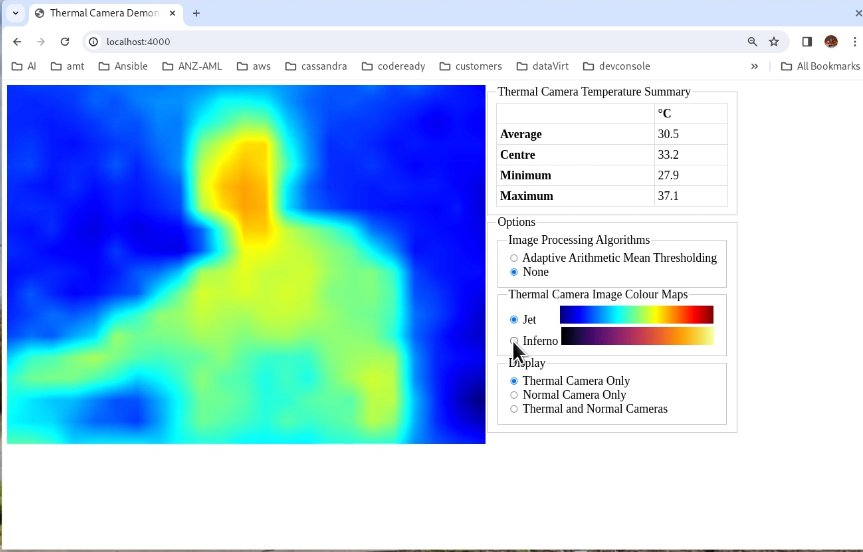

Using the 'Inferno' Colourmap:
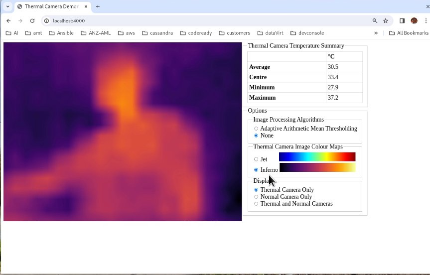

#### 4.3.3 The Display Panel
Next, we have the 'Display' option panel. You can choose to show images from the thermal camera only, normal camera only or Thermal and Normal Cameras ie, using both cameras. You have seen the first two options. Let's see the third option now:

Both Cameras (Using Adaptive Arithmetic Mean Thresholding Algorithm)
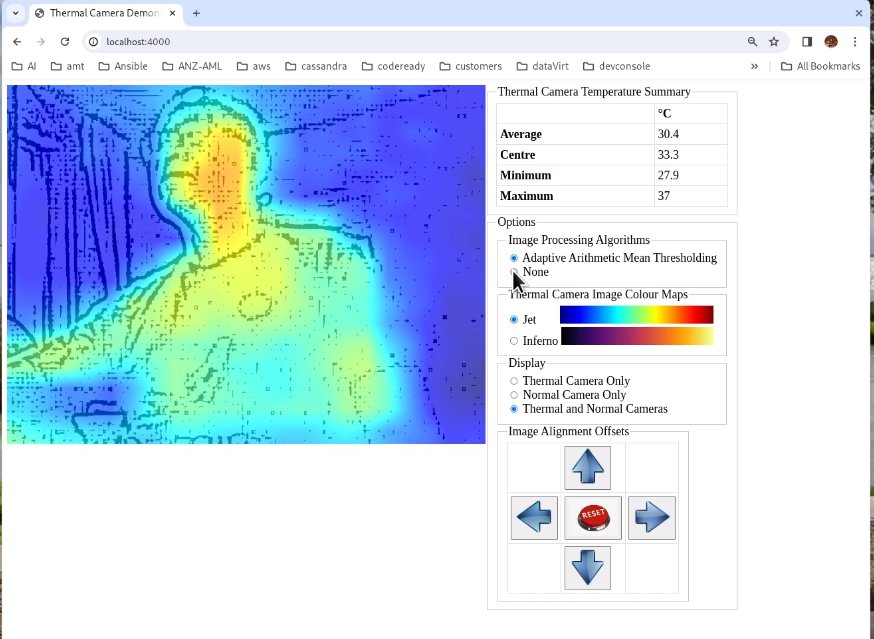

Both Cameras (Using no Image Processing Algorithm)
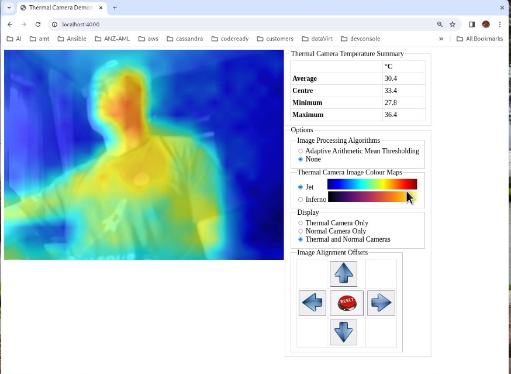

#### 4.3.4 The Image Alignment Offsets Panel
When you choose the 'Thermal and Normal Cameras' Display option, the 'Image Alignment Offsets' panel appears. It allows you to align the thermal and normal camera images to give the best picture. It is important especially for my prototype hack with cameras fastened together using rubber bands. Over time, the cameras may misalign slighly when I point my prototype to different targets repeatedly. In addition, the distance between the two cameras also introduces alignment and parallax errors. If you should spot a slight misalignment of the thermal and normal images in the Image panel, you can use these controls to adjust the image alignment as shown in the demo.

## 5. Running the Augmented Thermal Camera (ATC) Web Application 
The ATC applicaion has been containerised and available from quay.io:
~~~
quay.io/andyyuen/thermalcamera:1.0
~~~
You can deploy it by using Podman, MicroShift, OpenShift or other Kubernetes variants.

### 5.1 Deployment Prerequisites
You must have completed the following tasks before you deploy the ATC web application:
1. Configured the M5stick T-Lite Thermal Camera to connect to your Wifi network using the vendor provided instructions
2. Programmed the the M5CAMERA to run as a RSTP Server. See instruction in the 'rtspCamera' folder. And configured it to connect to your Wifi network
3. You have either Podman installed on you Linux notebook/desktop or have access to a working MicroShift or OpenShift cluster.
4. You have built your own prototype functionally equivalent to mine and successfully connected the cameras to your Wifi network and noted their IP address

### 5.2 Deploy Using Podman
1. Change to the 'deployment' folder
2. Change the parameters in the setENV.sh to match your environment. Here is a smaple configuration:
~~~
# Change the IP address to match your environment's
export RTSP_URL=rtsp://192.168.1.144:8554/mjpeg/1

export T_LITE_URL=http://192.168.1.145/json

# shift the thermal image this number of pixels to your right (positive value), negative value otherwise
export X_OFFSET=0
# shift the thermal image this number of pixels up (positive value), negative value otherwise
export Y_OFFSET=0

# set the level of transparency while overlapping the normal image to the thermal image
export ALPHA=0.7
~~~
3. From the command prompt:
~~~
./podmanDeplay.sh
~~~
4. Open a browser and point it to
~~~
http://localhost:4000
~~~

### 5.3 Deploy Using MicroShift/OpenShift
Steps 1 and 2 are the same as those in Section 5.2

3. From the command prompt:
~~~
./kubeDeploy.sh nameSpace microshift|openshift
~~~
Replace nameSpace with the namespace you want your pod to run in. If it does not exist, a namespace with the name you specified will be created for you.
The 2nd parameter must be either "microshift" or "openshift"
4. Open a browser and point it to
~~~
http://EXTERNAL-IP:32400
~~~
where EXTERNAL-IP is the IP address of the MicroShift server when "microshift' was specified as the 2nd parameter, or
 
the load balancer's EXTERNAL-IP address if "openshift" was specified.
The load balancer's EXTERNAL-IP address can be obtained using the command:
~~~
kubectl get svc -n nameSpace
~~~
where nameSpace is the namespace you specified. It will return information similar to that below:
~~~

NAME                TYPE           CLUSTER-IP      EXTERNAL-IP                                                               PORT(S)                               AGE
xxxx-pod            LoadBalancer   172.30.78.154   a1b99bba2453448e799780f15786331d-1806257633.us-east-2.elb.amazonaws.com   4000:32400/TCP                        3h51m
~~~
the EXTERNAL-IP from above is a1b99bba2453448e799780f15786331d-1806257633.us-east-2.elb.amazonaws.com
 Yours will be different.
  
<em>This assumes you are running your OpenShift cluster in the cloud eg, on AWS. If your OpenShift environment does not have loadbalancers eg, when using OpenShift Local (MicroShift or OpenShift), change the yamal's Service->spec->type from LoadBalancer to NodePort. And use MicroShift or OpenShift's server IP address as the external-ip.</em>

ENJOY!

Here are some highlights where details have been added to the low resolution thermal images.

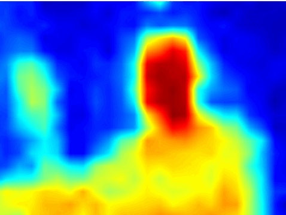

